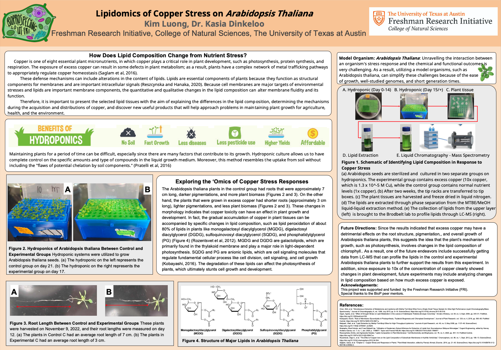

# Lipidomics of Copper Stress on *Arabidopsis thaliana*

Wet lab and exploratory investigation of copper toxicity effects on *Arabidopsis thaliana* morphology, designed as a precursor to lipidomic profiling via liquid chromatography-mass spectrometry (LC-MS). Conducted through the Freshman Research Initiative (FRI) at the University of Texas at Austin.

---

## Overview

Copper is an essential plant micronutrient, but excess copper disrupts key biological processes including photosynthesis, protein synthesis, and membrane integrity. This project investigates the morphological consequences of copper stress in *Arabidopsis thaliana* using a controlled hydroponic experiment, and establishes a lipid extraction pipeline intended for downstream LC-MS profiling.

The experiment compared 42 plants across control (1x copper) and high-copper (10x, 1.3×10⁻⁵ M Cu) hydroponic conditions, measuring root length, pigmentation, and biomass as indicators of copper toxicity. Lipid extraction using the MTBE/MeOH liquid-liquid method was completed and samples were submitted to the Brodbelt Lab for LC-MS analysis. Due to time constraints within the research period, LC-MS results were not collected — future work would incorporate lipid profiling data to characterize changes in MGDG, DGDG, SQDG, and PG composition under copper stress.

Findings were presented as a research poster at the Freshman Research Initiative, College of Natural Sciences, UT Austin.

---

## Experimental Design

| Parameter | Control Group | Experimental Group |
|-----------|---------------|-------------------|
| Copper concentration | 1x (standard nutrient solution) | 10x (1.3×10⁻⁵ M Cu) |
| Growth system | Hydroponics | Hydroponics |
| Sample size | 3 hydroponics (21 plants) | 3 hydroponics (21 plants) |
| Harvest day | Day 21 | Day 17 |
| Root measurement day | Day 12 | Day 12 |
| Measurements | Root length (cm), pigmentation (visual), biomass (count/visual) | Root length (cm), pigmentation (visual), biomass (count/visual) |

---

## Methods (Fig 1)

| Step | Description |
|------|-------------|
| Plant Growth | *Arabidopsis thaliana* seeds sterilized and germinated in separate hydroponic systems for control and experimental groups |
| Copper Treatment | Experimental group exposed to 10x copper concentration (1.3×10⁻⁵ M Cu) from Day 0 |
| Morphological Measurement | Root lengths measured at Day 12 using a ruler; pigmentation and biomass assessed visually and photographically |
| Tissue Harvest | Plants harvested and freeze-dried in liquid nitrogen |
| Lipid Extraction | MTBE/MeOH liquid-liquid extraction (Matyash et al., 2008) performed to isolate lipid fraction |
| LC-MS (Planned) | Lipid samples submitted to the Brodbelt Lab for profiling; results not collected within project timeline |

---

## Key Findings

- Stressed plants exhibited **lighter pigmentation** and **reduced overall biomass** relative to controls, consistent with chlorophyll degradation and disrupted photosynthesis under copper toxicity (Fig 2).
- Copper-stressed plants (*Experimental C*) showed a **57% reduction in average root length** compared to controls (3 cm vs. 7 cm), measured at Day 12 post-germination (Fig 3).
- Morphological changes align with published evidence of lipid peroxidation in copper-stressed plants, particularly degradation of galactolipids (MGDG, DGDG) and anionic lipids (SQDG, PG) critical to thylakoid membrane function.
- Lipid extraction was successfully completed using MTBE/MeOH phase separation; LC-MS profiling remains a planned future direction.



---

## Repository Structure

```
Arabidopsis-Lipidomics/
│
├── README.md
│
├── Data Observations.xlsx                  - root length data
├── LabImages.pdf                           - images for lab notebook
│
└── BioP_FRI_FinalPoster.png                — FRI research poster
```

---

## Skills Demonstrated

- Wet lab experimental design (hydroponic plant culture, control vs. experimental groups)
- Biological sample preparation (tissue harvest, freeze-drying, lipid extraction)
- Quantitative morphological data collection (root length measurement, biomass assessment)

---

## Future Directions

- Obtain LC-MS lipid profiling data from the Brodbelt Lab to characterize changes in MGDG, DGDG, SQDG, and PG composition under copper stress
- Expand copper concentration range to analyze dose-dependent lipid composition changes
- Integrate lipidomics data with morphological findings to build a comprehensive model of copper toxicity in *Arabidopsis thaliana*

---

## Course Context
**Program:** Freshman Research Initiative (FRI), Stream: BioP

**Institution:** College of Natural Sciences, The University of Texas at Austin

**Presented:** Research Poster, Fall 2022
