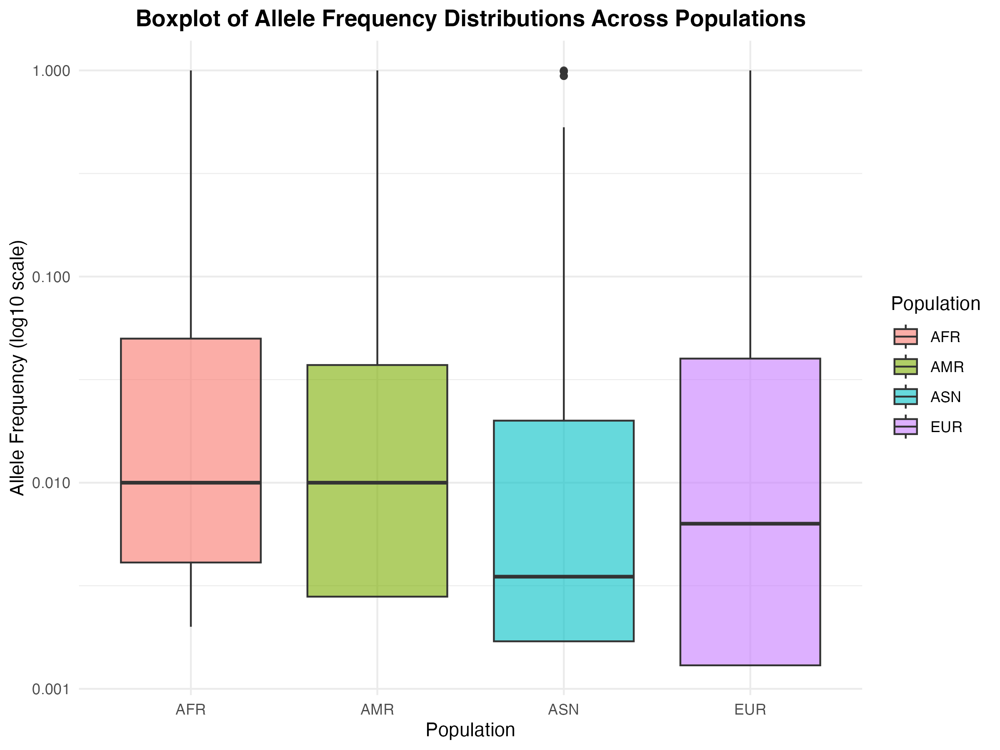
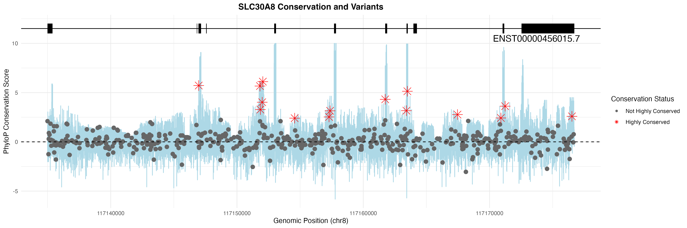

# Population and Evolutionary Analysis of SLC30A8 in Type 2 Diabetes

Integrative analysis of population-level allele frequency variation, evolutionary conservation, and gene expression patterns for *SLC30A8* — a zinc transporter gene implicated in Type 2 Diabetes (T2D) — using public genomic databases and a combination of Bash/Shell and R.

---

## Overview

SLC30A8 encodes the zinc transporter ZnT8, which plays a central role in insulin secretion within pancreatic β-cells. This project investigates whether SLC30A8 shows population-specific variation or expression differences that could explain its contribution to T2D risk across diverse human populations. Three complementary analyses were integrated:

1. **Population-level allele frequency variation** across AFR, AMR, ASN, and EUR populations
2. **Evolutionary conservation** of SLC30A8 variants using PhyloP 100-way vertebrate scores
3. **Population-level gene expression variation** among T2D-associated GWAS genes using RNA-seq data

---

## Methods & Tools

| Script | Analysis | Tools |
|--------|----------|-------|
| `01_extract_SLC30A8_variants.sh` | VCF download, variant extraction (chr8: 117,134,995–117,176,714), BED file generation, exon/intron classification, expression matrix header parsing | Bash/Shell, `wget`, `awk`, `gzip`, `sed`, `bedtools` |
| `02_population_variation.R` | Allele frequency extraction from INFO field, population-stratified summary statistics, boxplot visualization | R, `stringr`, `tidyr`, `dplyr`, `ggplot2` |
| `03_evolutionary_conservation.R` | PhyloP score join, high-conservation filtering (PhyloP > 2.27), exon structure overlay, conservation plot | R, `data.table`, `dplyr`, `ggplot2` |
| `04_expression_variation.R` | GEUVADIS FPKM matrix processing, per-population mean expression, log2 transformation, GWAS gene filtering, variance ranking, expression boxplots | R, `readxl`, `tidyr`, `dplyr`, `ggplot2` |

---

## Key Findings

- SLC30A8 variants are **globally rare and non-population-specific**, with average allele frequencies ranging from 0.071 (AFR) to 0.112 (EUR), consistent with strong purifying selection on a gene essential to insulin secretion.
    
  
- PhyloP analysis identified **8 peaks of high evolutionary conservation**, predominantly in exonic regions, with **15 highly conserved variants** (PhyloP > 2.27) flagged for potential regulatory significance.
    
  
- Among 200+ T2D-associated GWAS genes, SLC30A8 ranked **101st in population-level expression variance** (variance = 0.076), indicating highly stable expression across populations — further supporting strong regulatory constraint.
  - [Table2_Top_T2D_Genes_Population_Expression_Variation](Results/Top_T2D_Genes_Population_Expression_Variation.tsv)

---

## Repository Structure

```
SLC30A8-T2D-analysis/
│
├── README.md
│
├── scripts/
│   ├── 01_extract_SLC30A8_variants.sh   — download data, extract variants, parse header
│   ├── 02_population_variation.R        — allele frequency extraction, boxplot
│   ├── 03_evolutionary_conservation.R   — PhyloP scoring, conservation plot
│   └── 04_expression_variation.R        — GEUVADIS expression analysis, T2D gene ranking
│
├── results/
│   ├── figures/
│   │   ├── Fig1_AF_boxplot.png
│   │   ├── Fig2_conservation_plot.png
│   │   ├── Fig3_SLC30A8_expression_boxplot.png
│   │   └── Fig3_top_gene_expression_boxplot.png
│   └── tables/
│       ├── variants.tsv
│       ├── high_conserved_variants.tsv
│       └── Top_T2D_Genes_Population_Expression_Variation.tsv
│
├── report/
│   └── SLC30A8_T2D_Report.pdf
│
└──
```

---

## How to Run

```bash
# Step 1: Run the Bash pipeline (downloads data + extracts variants)
chmod +x scripts/01_extract_SLC30A8_variants.sh
./scripts/01_extract_SLC30A8_variants.sh

# Step 2–4: Run R scripts in order
Rscript scripts/02_population_variation.R
Rscript scripts/03_evolutionary_conservation.R
Rscript scripts/04_expression_variation.R
```

---

## Requirements

**Bash tools:** `wget`, `gzip`, `awk`, `sed`, `bedtools`
- bedtools: https://bedtools.readthedocs.io (expected at `./bedtools2-master/bin/intersectBed`)

**R version:** 4.3+

```r
install.packages(c("stringr", "tidyr", "dplyr", "ggplot2", "readxl", "data.table"))
```

---

## Data Access

| Dataset | Source | Link |
|---------|--------|------|
| 1000 Genomes Phase 1 VCF (chr8) | NCBI / 1000 Genomes Project | [Link](https://ftp-trace.ncbi.nih.gov/1000genomes/ftp/phase1/analysis_results/integrated_call_sets/) |
| GENCODE v49 gene annotation | GENCODE / EBI | [Link](https://ftp.ebi.ac.uk/pub/databases/gencode/Gencode_human/release_49/) |
| PhyloP 100-way vertebrate conservation | UCSC Genome Browser (GRCh38/hg38) | [Link](https://hgdownload.soe.ucsc.edu/goldenPath/hg38/phyloP100way/) |
| GEUVADIS RNA-seq expression matrix | ArrayExpress: E-GEUV-1 | [Link](https://www.ebi.ac.uk/gxa/experiments/E-GEUV-1/) |
| 1000 Genomes sample metadata | 1000 Genomes Project | [Link](https://ftp.1000genomes.ebi.ac.uk/vol1/ftp/technical/working/20130606_sample_info/) |
| T2D GWAS associations (MONDO:0005148) | GWAS Catalog | [Link](https://www.ebi.ac.uk/gwas/efotraits/MONDO_0005148) |

---

## Skills Demonstrated

- **Bash/Shell scripting:** automated data download, VCF processing, BED file generation, genomic coordinate filtering, bedtools intersect pipelines
- **R programming:** data wrangling, statistical summarization, multi-dataset integration
- **Population genetics:** allele frequency analysis across ancestral groups (AFR, AMR, ASN, EUR)
- **Evolutionary genomics:** PhyloP conservation scoring, exon/intron variant classification
- **Transcriptomics:** FPKM expression matrix processing, population-level variance analysis, GWAS gene filtering
- **Data visualization:** boxplots, conservation scatter plots, gene expression profiles

---

## Course Context

**Course:** BMI 5330: Introduction to Bioinformatics
The University of Texas Health Science Center at Houston, Fall 2025
