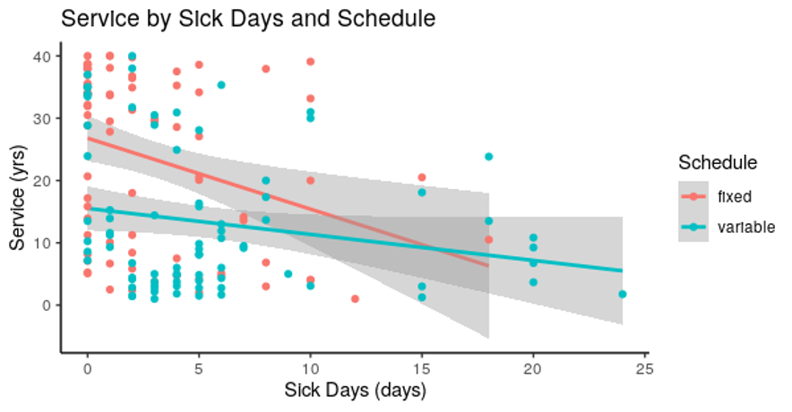

# Impact of Sick Days and Schedule Types on Total Years of Service Among Railroad Workers

Quantified the relationship between work schedule type, sick leave usage, and long-term employee retention in a federal railroad workforce dataset (246 records, Federal Railroad Administration, 2018) using simple linear regression and interaction modeling in R.

---

## Overview

Employee retention in safety-critical industries like rail transportation has significant operational and public safety implications. This project examines whether work schedule type and sick day usage predict total years of service among train and engine service workers, using a publicly available federal dataset from the Federal Railroad Administration. The analysis applies simple linear regression and interaction modeling to quantify these relationships and determine whether schedule type moderates the effect of sick leave on retention.

---

## Methods

| Step | Description |
|------|-------------|
| Data Loading | Loaded federal FRA dataset (246 observations) into R |
| Exploratory Analysis | Summary statistics and distribution checks for key variables |
| Simple Linear Regression | Modeled total years of service as a function of sick days and schedule type |
| Interaction Modeling | Tested whether schedule type moderates the effect of sick days on retention |
| Visualization | Interaction plots to display moderation effects across schedule groups |

**Tools:** R (base R, `ggplot2`)

---

## Key Findings

- Controlling the number of sick days, the type of schedule that a T&E worker has is a significant predictor of the total years of service (t = -4.048, df = 156, p = 7.06e-5). For T&E workers with an average number of sick days, having a variable schedule will decrease the total years of service by 8.161 years.
- Controlling for schedule, the number of sick days that a T&E worker takes is a significant predictor of the total years of service (t = -3.199, df = 156, p = 1.67e-3). For each increase of 1 sick day, the total years of service as a T&E worker with a fixed schedule decreases by 1.139 years.
- We found no significant interaction between the number of sick days and type of schedule on the total years of service of T&E workers (t = 1.672, df = 156, p = 0.0966).
- Interaction plot analysis revealed that the effect of sick days on retention **differed significantly by schedule type**, suggesting that schedule structure moderates how sick leave impacts long-term employment.


  
- Results provide quantitative evidence that schedule-based workforce policy adjustments could meaningfully influence employee retention in rail transportation.

---

## Repository Structure

```
[T&Eworkers-RegressionAnalysis]/
│
├── README.md
├── T&E_Analysis_Script.R         — regression pipeline in R
├── T&E_Presentation_Slides.pdf   — Presentation slides
└── Results/                      — contains Interaction Plot
```

> Presentation can be accessed here: (https://youtu.be/wxXWS2YZR5k)

---

## Dataset

| Field | Detail |
|-------|--------|
| **Title** | Work Schedules and Sleep Patterns of Railroad Employees — Train and Engine Service |
| **Source** | Federal Railroad Administration (FRA) |
| **Year** | 2018 |
| **Records** | 246 observations |
| **Link** | [data.cms.gov](https://catalog.data.gov/dataset/work-schedules-and-sleep-patterns-of-railroad-employees-train-and-engine-service-railroad-) |

> The raw dataset is publicly available at the link above. It is not included in this repository.

---

## Skills Demonstrated

- Simple linear regression modeling in R
- Interaction effect testing and interpretation
- Interaction plot visualization
- Analysis of federal workforce datasets
- Written and oral communication of statistical findings

---

## Course Context
**SDS 320E:** Elements of Statistics

The University of Texas at Austin

Fall 2022
