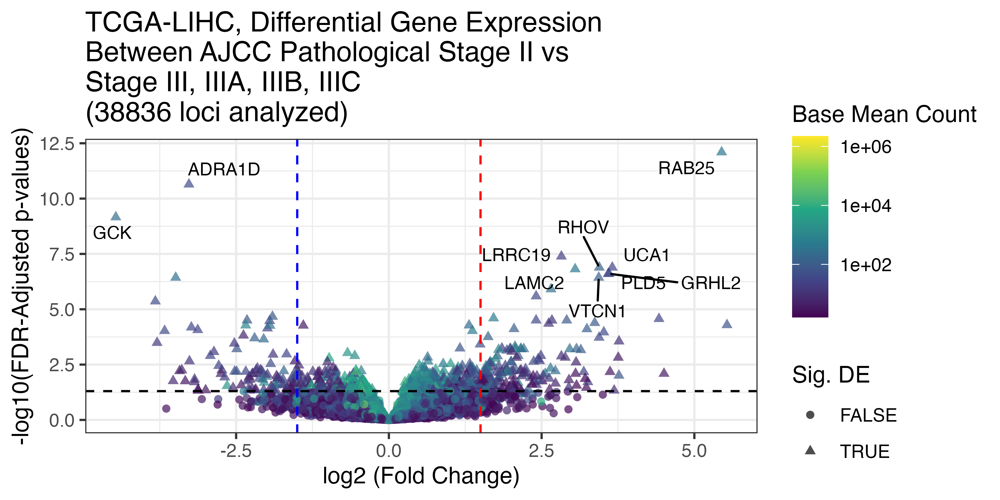

# Differential Gene Expression Analysis of Liver Hepatocellular Carcinoma (LIHC)

RNA-seq differential expression analysis comparing AJCC Stage II and Stage III hepatocellular carcinoma (HCC) tumors using TCGA-LIHC data, with a full pipeline built in R using DESeq2 and Bioconductor.

---

## Overview

Hepatocellular carcinoma (HCC) is one of the most common and lethal cancers globally, with prognosis varying significantly by tumor stage. This project investigates the transcriptional differences between early-late (Stage II) and late (Stage III) HCC by applying a differential expression analysis pipeline to publicly available TCGA RNA-seq data. Identifying stage-specific gene expression changes provides insight into the molecular mechanisms driving tumor progression and may inform future biomarker or therapeutic target discovery.

---

## Methods

| Step | Description | Tools |
|------|-------------|-------|
| Data Access | TCGA-LIHC RNA-seq count data (99 samples, 38,836 genes) queried from GDC | `TCGAbiolinks` |
| Sample Filtering | Filtered to Stage II (n = ~50) and Stage III (n = ~49) primary tumor samples | `TCGAbiolinks` |
| Quality Control | PCA to identify and remove outlier samples | `DESeq2`, `ggplot2` |
| Normalization | DESeq2 median-of-ratios normalization | `DESeq2` |
| Differential Expression | Negative binomial GLM, Wald test, BH multiple testing correction | `DESeq2` |
| Visualization | Volcano plot with top gene labels | `ggplot2`, `ggrepel` |
| Output | Full DEG table, upregulated/downregulated subsets | base R |

---

## Key Findings

- **715 significantly differentially expressed genes** identified between Stage II and Stage III HCC (FDR-adjusted p < 0.05), including 446 upregulated and 269 downregulated in Stage III tumors.  
- **RAB25** (log2FC = 5.45, p = 2.98×10⁻¹⁷) was the top upregulated gene — a known driver of tumor invasion and metastasis via vesicle trafficking dysregulation.
- **GCK** (log2FC = −4.47, p = 7.72×10⁻¹⁴) was the top downregulated gene — a glucokinase involved in hepatic glucose metabolism, consistent with the metabolic reprogramming characteristic of late-stage HCC.

    
  
- PCA-based outlier detection identified and removed low-quality samples prior to modeling, improving the reliability of downstream differential expression results.

---

## Repository Structure

```
TCGA-LIHC-DEGanalysis/
│
├── README.md
│
├── Scripts/
│   ├── CleaningData.R             # Clean the data before pipeline
│   ├── DEG_Functions.R            # PCA, Volcano Plot, resOutput functions
│   ├── SupplementaryDataFiles.R   # Functions to write Samples.csv and Loci.csv 
│   └── LIHC_DEG_pipeline.R        # full DESeq2 analysis pipeline
│
├── Results/
│   ├── Fig1_PCA1.png
│   ├── Fig2_PCA2.png
│   └── Fig3_VolcanoPlot.png
│
├── SupplementaryFiles/
│   ├── Samples.csv
│   └── Loci.csv 
│
└── Report/
    └── LIHC_DEG_Report.pdf
```

---

## Requirements

**R version:** 4.3+

```r
if (!require("BiocManager")) install.packages("BiocManager")
BiocManager::install(c("TCGAbiolinks", "DESeq2", "Bioconductor"))
install.packages(c("ggplot2", "ggrepel"))
```

---

## Data Access

| Dataset | Source | Link |
|---------|--------|------|
| TCGA-LIHC RNA-seq counts | NIH Genomic Data Commons (GDC) | [Link](https://portal.gdc.cancer.gov/projects/TCGA-LIHC) |
| Clinical stage annotations | GDC (queried via TCGAbiolinks) | Included in pipeline |

> Raw data is downloaded programmatically by the pipeline script via `TCGAbiolinks::GDCquery()`. No manual download required.

---

## Skills Demonstrated

- End-to-end RNA-seq differential expression pipeline in R
- Public genomic data access and querying (TCGA/GDC via TCGAbiolinks)
- PCA-based quality control and outlier detection
- Negative binomial modeling with DESeq2
- Multiple testing correction (Benjamini-Hochberg FDR)
- Volcano plot visualization with gene-level annotation (`ggrepel`)
- Biological interpretation of cancer transcriptomics results

---

## Course Context
**INB 321G:** Computational Biology

The University of Texas at Austin

Fall 2024
